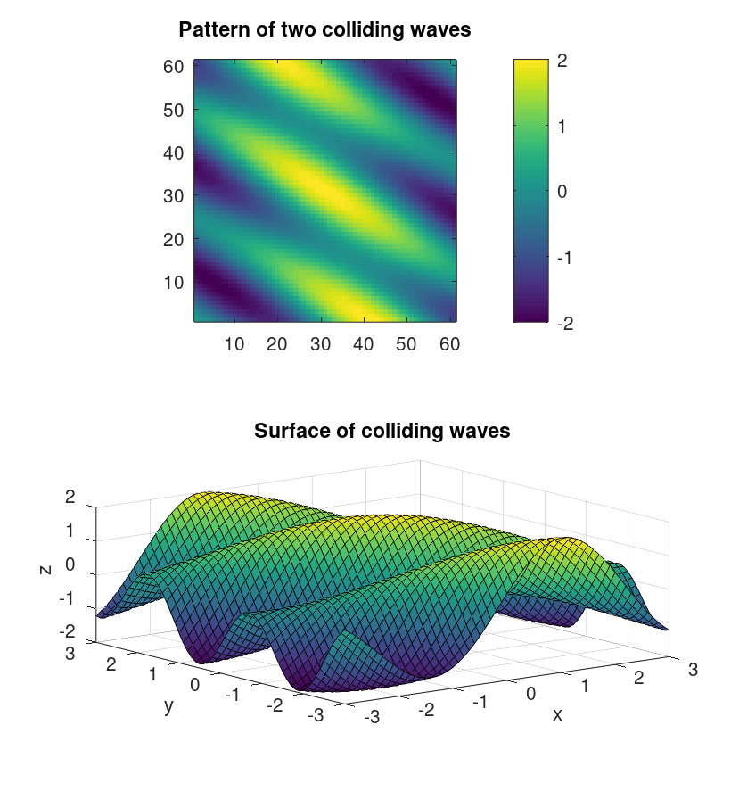
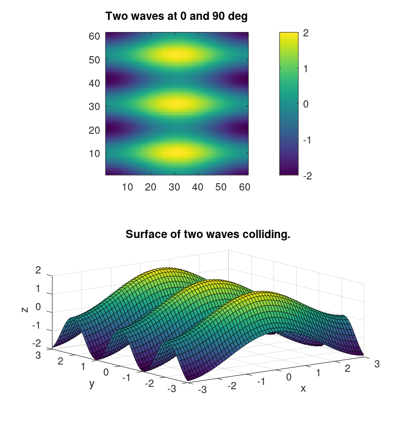
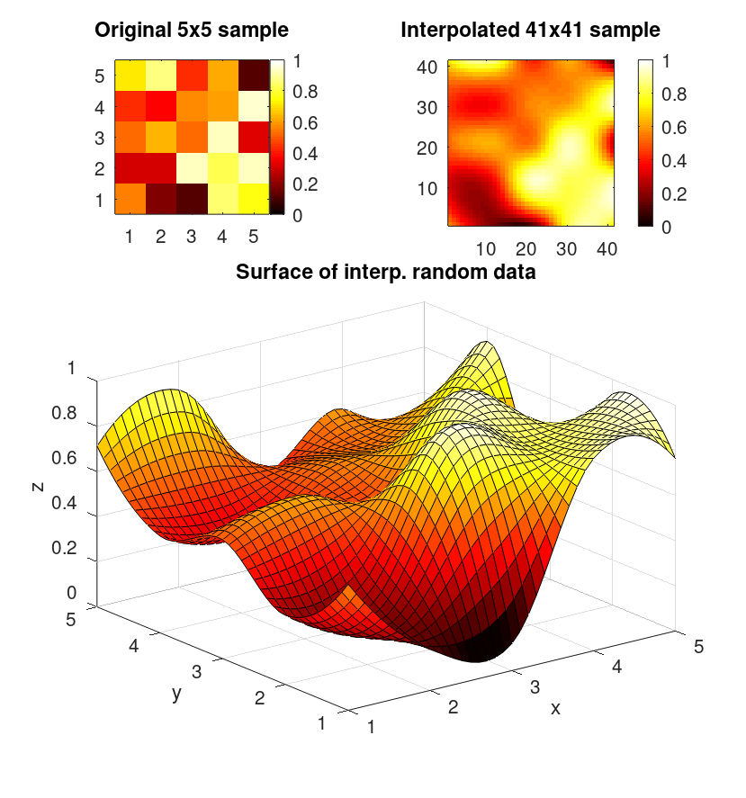
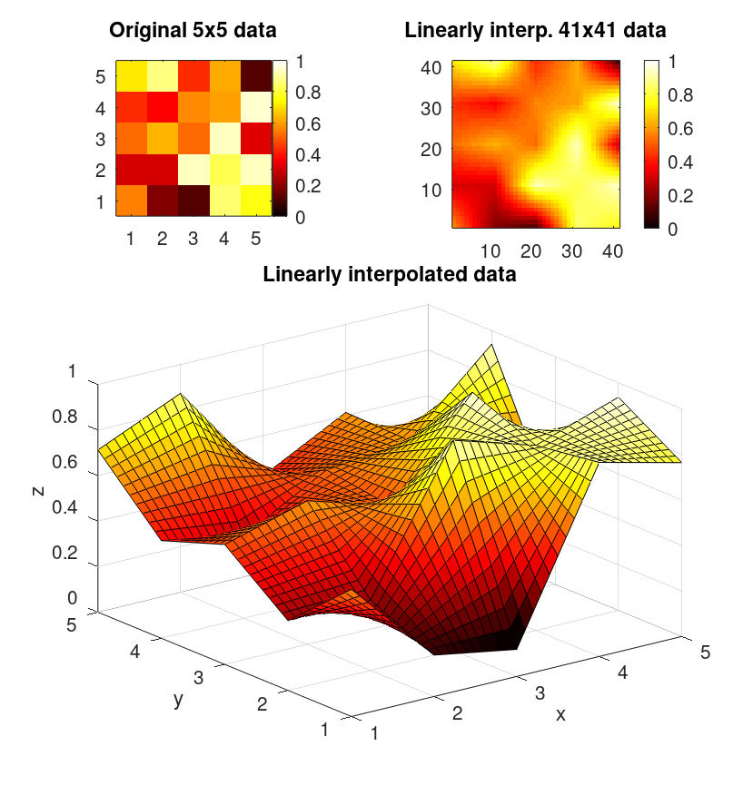

# Wave thingy

While still working on something new, I sumbled across some curious realization while mathematically trying to adress the
parameters of a cosine function, in which I accidentally inputed this details and suddenly it turned into this formula:

$$
\vec{Z} (A,B) = z \cos f \left( A \hat{x} + B \hat{y} \right) \hat{z}
$$

In which, believe it or not, we can say the $\hat{x}$ and
$\hat{y}$ vectors are actually the meshgrid objects, $f$
is the frequency and $A,B$ are the components of the
direction vector of the plane that sits perpendicular to
the wave front.

Based on this, I decided to put this into a full
standard MATLAB function, by writing all of these
details into it.

For keeping it simple, I kept frequency as _natural_
and assumed direction angle would be provided in
degrees; while I ask for the `x` and `y` meshgrid
objects to porperly locate the values of my function
in the space.

```matlab
function Z = wave_dir(X, Y, freq, dir)

% Be X and Y two meshgrid matrices,
% and Z its correspondent value.
%
% dir is an angle to which the wave
% is directed.
%
% freq is the wave s frequency

h = cosd(dir); k = sind(dir);

Z = cos( freq.*(h.*X + k.*Y) );
```

And this is the function I just came up with, available
here at [wave_dir](wave_dir.m) y'all.

It makes linear waves that could either look like this:


Or like this:



# Interpolation mechanism on MATLAB/GNU Octave.

I am discussing with y'all this wonderful mathematical tool in the context of this very powerful math 
machines we use for science and data processing almost everytime as it's really cool to do all this! 
For now, we are pretty much not doing that much of a difficult set of stunts to come up with something 
flashy, we are rather just providing this with some fairly simple usecases.

Let's begin with a 5 by 5 grid with this random pack of data this way. First, we call `t` an interval from 1 to
5, which is going to set the size of our small grid. Then,
we use `meshgrid` to create said plane. Our data sample
is a random 5 by 5 noise, and we are going to interpolate 
it with MATLAB's builtin function into a 40 by 40
meshgrid; thus transforming: *small* mat -> *Big* mat.

Now, to display the data we made, we might want to 
`imagesc` our `Z` matrix, so to  watch what we are going 
from and what are we now composing based off it.

After this, we can compare in a figure each thing, to see how did the process transform the 
original noise sample into some meaningful data, could it be useful for us at any given 
point

```matlab
t = 1:5;
T = linspace(1,5,40);
[X, Y] = meshgrid(t,t);
Z = rand(5,5);
[X1, Y1] = meshgrid(T,T);
Z1 = interp2( X,Y,Z, X1,Y1);
% is up to you choosing the method:

subplot(2,2,1)
imagesc(Z); colormap('hot'); colorbar;
axis('equal')
subplot(2,2,2)
imagesc(Z1); colormap('hot'); colorbar;
axis('equal')
subplot(2,2,3:4)
surf(X1,Y1,Z1); colormap('hot'); hold on
contour(X1,Y1,Z1)
```



This is a cubic interpolation



And this is a linear interpolation
